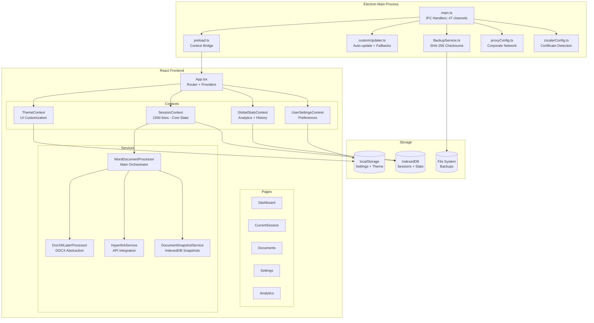

# Documentation Hub - Codebase Architecture Review

**Version:** 3.3.0
**Analysis Date:** 2025-11-28
**Analyst:** Claude Code

---

## 1. Executive Summary

Documentation Hub is a professional-grade Electron desktop application for document processing workflows, built with React 19, TypeScript 5.9, and Vite 7. The application features session-based document management, hyperlink processing with PowerAutomate API integration, comprehensive styling controls, and robust backup/recovery mechanisms.

**Key Strengths:**
- Solid security fundamentals (context isolation, secure IPC, path validation)
- Comprehensive error handling with recovery mechanisms
- Well-organized component architecture with proper state management
- Sophisticated corporate network support (Zscaler, proxy, certificate handling)

**Areas for Improvement:**
- Test infrastructure needs configuration (addressed in this review)
- Some type safety gaps in IndexedDB and Electron API layers
- Minor security enhancements needed (URL protocol validation, credential masking)

---

## 2. Architecture Diagram



---

## 3. Code Quality Assessment

| Area | Score | Details |
|------|-------|---------|
| **Type Safety** | 4/5 | Strong TypeScript usage with strict mode. Some `any` returns in IndexedDB (line 442) and Electron API (line 111). |
| **Error Handling** | 4.5/5 | Comprehensive try-catch, backup recovery, graceful degradation. Minor gaps in storage cleanup. |
| **Testing** | 2/5 | Test infrastructure exists but was misconfigured. Fixtures missing. Coverage needs improvement. |
| **Performance** | 4/5 | O(1) lookups, connection pooling, debounced persistence, virtual lists. Some unnecessary re-renders possible. |
| **Maintainability** | 4/5 | Well-organized, good separation of concerns. SessionContext too large (1930 lines). |

---

## 4. Findings Table

| ID | Issue | Severity | Location | Recommendation |
|----|-------|----------|----------|----------------|
| **CRITICAL** |||||
| C-1 | Missing Jest configuration | Critical | Root | Fixed: Added jest.config.js |
| C-2 | Hyperlink index tracking bug | High | WordDocumentProcessor.ts:568 | Fix `i % 10` to use actual hyperlink index |
| C-3 | Incomplete storage cleanup | High | DocumentSnapshotService.ts:446 | Implement oldest-first deletion algorithm |
| **SECURITY** |||||
| S-1 | URL protocol validation missing | Medium | preload.ts:194 | Add protocol whitelist for openExternal() |
| S-2 | Weak certificate validation | Medium | main.ts:1561 | Validate X.509 structure, not just string check |
| S-3 | Credentials not masked in logs | Medium | proxyConfig.ts:118 | Mask password in log output |
| S-4 | GitHub certs trusted without pinning | Medium | main.ts:576 | Consider certificate pinning |
| **TYPE SAFETY** |||||
| T-1 | IndexedDB returns `any` type | Medium | indexedDB.ts:442 | Return `SerializedSession \| null` |
| T-2 | processDocument returns `unknown` | Medium | electron.ts:111 | Type as `ProcessingResult` |
| T-3 | Missing null check in truncate | Medium | indexedDB.ts:721 | Add `doc?.processingResult?.changes` guard |
| **ARCHITECTURE** |||||
| A-1 | SessionContext too large | Medium | SessionContext.tsx | Split into SessionListContext + SessionProcessingContext |
| A-2 | 16 useState calls in ThemeContext | Low | ThemeContext.tsx:51-146 | Consider useReducer |
| A-3 | Toast timeout not cleaned up | Low | useToast.tsx:22 | Add cleanup on unmount |
| A-4 | Global state for installer path | Low | customUpdater.ts:302 | Use class property instead |
| **PERFORMANCE** |||||
| P-1 | getTodayStats returns new object | Low | GlobalStatsContext:246 | Memoize return value |
| P-2 | Multiple theme useEffect hooks | Low | ThemeContext:150-342 | Consolidate into fewer effects |
| **DEPRECATED** |||||
| D-1 | Deprecated session fields | Low | session.ts:202-216 | Remove `appendContentId`, `contentIdToAppend` |

---

## 5. Priority Actions (Impact/Effort Ranked)

### 1. Fix Jest Configuration ✅ DONE
- **Impact:** High - Enables test development and CI/CD
- **Effort:** Low
- **Status:** Completed in this review

### 2. Fix Hyperlink Index Tracking Bug
- **Impact:** High - Incorrect change reports affect user trust
- **Effort:** Low
- **Location:** `src/services/document/WordDocumentProcessor.ts:568, 613, 686`
- **Fix:** Store hyperlink index during extraction, pass through to change tracking

### 3. Add URL Protocol Validation
- **Impact:** High - Security vulnerability
- **Effort:** Low
- **Location:** `electron/preload.ts:194`
- **Fix:**
```typescript
openExternal: (url: string) => {
  const parsed = new URL(url);
  if (!['http:', 'https:', 'mailto:'].includes(parsed.protocol)) {
    throw new Error('Only http/https/mailto URLs allowed');
  }
  return shell.openExternal(url);
}
```

### 4. Implement Storage Cleanup
- **Impact:** Medium - Prevents storage exhaustion
- **Effort:** Medium
- **Location:** `src/services/document/DocumentSnapshotService.ts:446-466`
- **Fix:** Implement oldest-first deletion when exceeding 100MB limit

### 5. Improve Type Safety in IndexedDB
- **Impact:** Medium - Better developer experience
- **Effort:** Low
- **Location:** `src/utils/indexedDB.ts:442`
- **Fix:** Change return type from `any` to `SerializedSession | null`

---

## 6. Technical Debt Inventory

### Immediate (Next Sprint)
- [ ] Fix hyperlink index tracking (C-2)
- [ ] Add URL protocol validation (S-1)
- [ ] Mask credentials in logs (S-3)
- [ ] Fix IndexedDB type safety (T-1, T-2, T-3)

### Short-term (Next Release)
- [ ] Implement storage cleanup (C-3)
- [ ] Validate X.509 certificates (S-2)
- [ ] Split SessionContext (A-1)
- [ ] Add toast cleanup (A-3)

### Medium-term (Backlog)
- [ ] Refactor ThemeContext with useReducer (A-2)
- [ ] Add certificate pinning (S-4)
- [ ] Memoize GlobalStats selectors (P-1)
- [ ] Remove deprecated session fields (D-1)
- [ ] Consolidate theme effects (P-2)

### Long-term (Future Consideration)
- [ ] Add comprehensive test coverage (target 80%)
- [ ] Implement memory leak detection
- [ ] Add performance monitoring
- [ ] Consider Web Workers for large document processing

---

## 7. Module Summary

### Electron Layer (8 files, ~4,500 lines)
| Module | Responsibility | Key Concerns |
|--------|---------------|--------------|
| main.ts | IPC handlers, window management | 47 IPC channels, security settings |
| preload.ts | Context bridge API | URL validation needed |
| customUpdater.ts | Auto-update with 4 fallback strategies | Global state usage |
| BackupService.ts | SHA-256 checksums, 7-day retention | Clean implementation |
| proxyConfig.ts | Corporate proxy detection | Credential logging concern |
| zscalerConfig.ts | Certificate discovery (12 locations) | Complex but comprehensive |

### React Layer (45+ components, ~10,000 lines)
| Module | Responsibility | Key Concerns |
|--------|---------------|--------------|
| SessionContext | Core state management (1930 lines) | Too large, should split |
| ThemeContext | UI customization | Many useState calls |
| GlobalStatsContext | Analytics + history | Good connection pooling |
| WordDocumentProcessor | Document pipeline orchestrator | Index tracking bug |
| HyperlinkService | PowerAutomate API integration | Good retry logic |
| DocumentSnapshotService | IndexedDB snapshots | Storage cleanup incomplete |

### Utilities (13 files, ~2,500 lines)
| Module | Responsibility | Key Concerns |
|--------|---------------|--------------|
| indexedDB.ts | Connection pool + persistence | Type safety gaps |
| logger.ts | Structured logging + sanitization | Unix path pattern incomplete |
| pathSecurity.ts | Path traversal prevention | Excellent defense-in-depth |
| urlSanitizer.ts | XSS prevention | Good protocol whitelist |
| MemoryMonitor.ts | Heap tracking + checkpoints | Duplicate field |

---

## 8. Recommendations Summary

### Security
1. Validate URL protocols before opening external links
2. Validate X.509 certificate structure on import
3. Mask proxy credentials in log output
4. Consider certificate pinning for GitHub updates

### Code Quality
1. Fix Jest configuration for test development
2. Fix hyperlink index tracking in change reports
3. Improve IndexedDB return types
4. Add null checks in session truncation

### Architecture
1. Split SessionContext into smaller focused contexts
2. Refactor ThemeContext to use useReducer
3. Consolidate theme-related useEffect hooks
4. Clean up toast timeouts on unmount

### Performance
1. Memoize GlobalStats selector returns
2. Implement storage cleanup to prevent exhaustion
3. Consider lazy loading for heavy components
4. Add memory leak detection

---

## 9. Appendix: IPC Channel Reference

<details>
<summary>Click to expand IPC channel list (47 total)</summary>

### Window Management (6)
- `window-minimize`, `window-maximize`, `window-close`
- `window-is-maximized`, `window-is-fullscreen`, `app-version`

### File Operations (9)
- `select-documents`, `process-document`, `show-in-folder`
- `open-document`, `get-file-stats`, `restore-from-backup`
- `file:read-buffer`, `document:extract-text`, `open-comparison-window`

### Hyperlink Processing (5)
- `hyperlink:select-files`, `hyperlink:process-document`
- `hyperlink:batch-process`, `hyperlink:validate-api`, `hyperlink:cancel-operation`

### Backup Management (8)
- `backup:create`, `backup:restore`, `backup:list`, `backup:delete`
- `backup:cleanup`, `backup:cleanup-all`, `backup:verify`, `backup:storage-info`

### Certificate Management (7)
- `check-zscaler-status`, `get-certificate-path`, `get-installed-certificates`
- `import-certificate`, `auto-detect-certificates`, `remove-certificate`, `test-github-connection`

### Auto-Updater (4)
- `check-for-updates`, `download-update`, `install-update`, `open-update-in-browser`

### Settings & Misc (8)
- `export-settings`, `import-settings`, `save-export-data`
- `platform`, `open-dev-tools`, window events

</details>

---

**Report Generated By:** Claude Code
**Commit:** See git history for fixes applied during review
